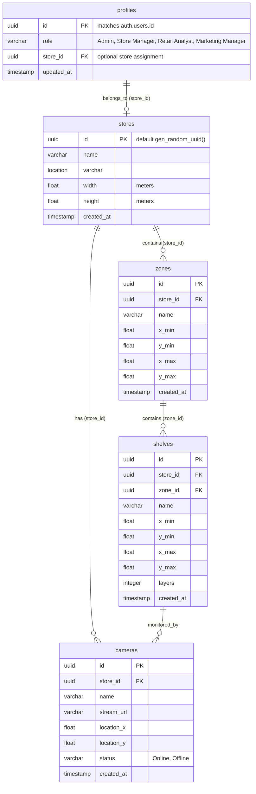

# Consumer Attention Mapping System (Milestone 1)

This project forms the foundational core of the **Consumer Attention Mapping System** for physical retail stores. It establishes the secure relational database, user authentication/authorization, visual store layout canvas designer, and live security camera streaming architecture using OpenCV.

---

## 🎯 Key Features

- **Role-Based Access Control (RBAC)**: Supports `Admin`, `Store Manager`, `Retail Analyst`, and `Marketing Manager` roles via Supabase Auth & PostgreSQL profiles, protecting endpoints with role-restrictive JWT middleware.
- **Interactive Store Layout Canvas**: Grid-based designer built in React using SVG coordinates mapping store physical dimensions (meters) to manage zones, shelves (with configurable shelf layer configurations), and camera placement markers.
- **Live Video Streaming Ingestion**: High-performance OpenCV (cv2) MJPEG transcoder and relay backend service capable of relaying live hardware camera indices, video files, or RTSP streams into standard multipart HTTP stream boundaries in real-time.
- **Robust Local Environments**: Complete SQLite/Supabase integrations, virtual environments, development scripts, and comprehensive unit tests for rapid development.

---

## 🛠️ Tech Stack

- **Backend**: Python 3.12, FastAPI, Uvicorn, Python-Supabase, OpenCV-Python (`cv2`), Pydantic
- **Frontend**: JavaScript (ES6+), React 19, Vite, Lucide React icons, Tailwind CSS
- **Database**: Supabase PostgreSQL (Core & Auth schema)
- **Testing**: Pytest (backend), Vitest (frontend)

---

## ⚙️ Prerequisites

Before getting started, make sure you have:
- **Python**: Version 3.12 or higher
- **Node.js**: Version 20 or higher
- **NPM** (packaged with Node.js)
- **Supabase Account**: Live Supabase project for PostgreSQL databases.

---

## 🚀 Getting Started

### 1. Clone the Repository
```bash
git clone https://github.com/arisan1906/consumer-attention-mapping-system.git
cd consumer-attention-mapping-system
```

### 2. Environment Variables Configuration

#### Backend Env (`backend/.env`)
Ensure `backend/.env` contains your live Supabase credentials:
```env
SUPABASE_URL=https://famuonvjmgakdumlmujk.supabase.co
SUPABASE_KEY=your-supabase-service-role-or-anon-key
JWT_SECRET=your-jwt-auth-signing-secret
```

#### Frontend Env (`frontend/.env`)
Verify the frontend variables:
```env
VITE_SUPABASE_URL=https://famuonvjmgakdumlmujk.supabase.co
VITE_SUPABASE_ANON_KEY=your-supabase-anon-key
```

---

### 3. Setting Up the Backend Server

1. Navigate to the `backend/` directory:
   ```bash
   cd backend
   ```
2. Set up and activate a virtual environment:
   - **Windows (PowerShell)**:
     ```powershell
     python -m venv venv
     .\venv\Scripts\Activate.ps1
     ```
   - **macOS / Linux**:
     ```bash
     python3 -m venv venv
     source venv/bin/activate
     ```
3. Install dependencies:
   ```bash
   pip install -r requirements.txt
   ```
4. Start the FastAPI development server:
   ```bash
   uvicorn app.main:app --reload --port 8000
   ```
5. Open **`http://127.0.0.1:8000/docs`** in your browser to view the interactive Swagger Doxygen documentation.

---

### 4. Setting Up the Frontend App

1. Open a new terminal window and navigate to the `frontend/` directory:
   ```bash
   cd frontend
   ```
2. Install npm packages:
   ```bash
   npm install
   ```
3. Run the Vite development server:
   ```bash
   npm run dev
   ```
4. Open **`http://localhost:5173/`** to interact with the application.

---

## 🏛️ Architecture & Data Model

### Directory Structure
```text
consumer-attention-mapping-system/
├── backend/                  # FastAPI Application
│   ├── app/
│   │   ├── api/              # Routers (auth.py, store.py, camera.py)
│   │   ├── core/             # Core settings & JWT credentials
│   │   ├── database/         # Supabase client setup
│   │   ├── services/         # OpenCV streaming & layouts
│   │   └── main.py           # FastAPI entry point
│   ├── tests/                # Pytest suite
│   └── requirements.txt      # Python dependencies
├── frontend/                 # Vite-React SPA
│   ├── src/
│   │   ├── components/       # AuthScreen, Canvas Layout Editor, CameraPlayer
│   │   ├── services/         # Supabase Client configuration
│   │   ├── App.jsx           # Main routing and navigation
│   │   └── main.jsx          # Entry point
│   ├── package.json          # Node configurations
│   └── vite.config.js        # Vite parameters
├── database_schema.sql       # Database schema dump file
├── stream_demo.py            # Local OpenCV verification script
└── milestone1_postman_collection.json # API Test collection
```

### Entity-Relationship Diagram (ERD)



---

## 🧪 Testing and Verification

### Running Automated Test Suites

- **Backend Pytest tests**:
  ```bash
  cd backend
  .\venv\Scripts\pytest
  ```
- **Frontend Vitest tests**:
  ```bash
  cd frontend
  npm run test
  ```

---

### OpenCV Streaming Verification Script (`stream_demo.py`)

A stand-alone OpenCV ingestion verification script is available in the project root. This utility verifies frame processing stability, resizing logic, FPS speed calculations, and frame logs, ensuring no memory leaks occur.

Run the script from the root using the backend venv:
```bash
# To run using a synthetic high-fidelity animated layout (headless/safe fallback)
backend\venv\Scripts\python stream_demo.py --source synthetic

# To run using a local camera / webcam index (e.g. 0)
backend\venv\Scripts\python stream_demo.py --source 0

# To run using a sample video file
backend\venv\Scripts\python stream_demo.py --source /path/to/video.mp4

# To run using a network RTSP feed URL
backend\venv\Scripts\python stream_demo.py --source rtsp://192.168.1.100/h264
```

---

### Postman API Integration Collection (`milestone1_postman_collection.json`)

To verify and test API responses:
1. Import **`milestone1_postman_collection.json`** into your Postman Workspace.
2. The collection is pre-configured with environment variables: `baseUrl`, `jwt_token`, `store_id`, and `camera_id`.
3. Running **"Login Admin User"** will automatically extract the `access_token` and save it to the collection's variables, allowing subsequent requests to run seamlessly.
4. Run requests to test Store Layout CRUD, Role profile fetching, Camera registration, and MJPEG feed relays.
5. Check failure endpoints to confirm `401 Unauthorized` and `403 Forbidden` response parameters.
