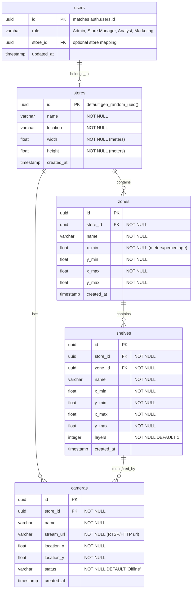

# Data Model Design

This document defines the schema for the primary database (Supabase PostgreSQL).

## Database Schema (PostgreSQL)



### Table Definitions & SQL Script

```sql
-- Enable UUID extension
create extension if not exists "uuid-ossp";

-- 1. Create Profile Table linking to auth.users
create table public.profiles (
  id uuid references auth.users on delete cascade primary key,
  role varchar(50) not null check (role in ('Admin', 'Store Manager', 'Retail Analyst', 'Marketing Manager')),
  store_id uuid,
  updated_at timestamp with time zone default timezone('utc'::text, now()) not null
);

-- 2. Create Stores Table
create table public.stores (
  id uuid default gen_random_uuid() primary key,
  name varchar(255) not null,
  location varchar(255) not null,
  width float not null,
  height float not null,
  created_at timestamp with time zone default timezone('utc'::text, now()) not null
);

-- Add foreign key constraint to profiles once store table is made
alter table public.profiles
  add constraint fk_profiles_store foreign key (store_id) references public.stores(id) on delete set null;

-- 3. Create Zones Table
create table public.zones (
  id uuid default gen_random_uuid() primary key,
  store_id uuid references public.stores(id) on delete cascade not null,
  name varchar(255) not null,
  x_min float not null,
  y_min float not null,
  x_max float not null,
  y_max float not null,
  created_at timestamp with time zone default timezone('utc'::text, now()) not null
);

-- 4. Create Shelves Table
create table public.shelves (
  id uuid default gen_random_uuid() primary key,
  store_id uuid references public.stores(id) on delete cascade not null,
  zone_id uuid references public.zones(id) on delete cascade not null,
  name varchar(255) not null,
  x_min float not null,
  y_min float not null,
  x_max float not null,
  y_max float not null,
  layers integer default 1 not null,
  created_at timestamp with time zone default timezone('utc'::text, now()) not null
);

-- 5. Create Cameras Table
create table public.cameras (
  id uuid default gen_random_uuid() primary key,
  store_id uuid references public.stores(id) on delete cascade not null,
  name varchar(255) not null,
  stream_url varchar(1024) not null,
  location_x float not null,
  location_y float not null,
  status varchar(50) default 'Offline' not null check (status in ('Online', 'Offline')),
  created_at timestamp with time zone default timezone('utc'::text, now()) not null
);
```

### Row Level Security (RLS) Rules

- **Profiles Table**:
  - Authenticated users can view their own profile.
  - Administrators can select, update, and insert all profiles.
- **Stores, Zones, Shelves, Cameras Tables**:
  - Anyone authenticated can read.
  - Only Administrators and Store Managers can insert/update/delete.
